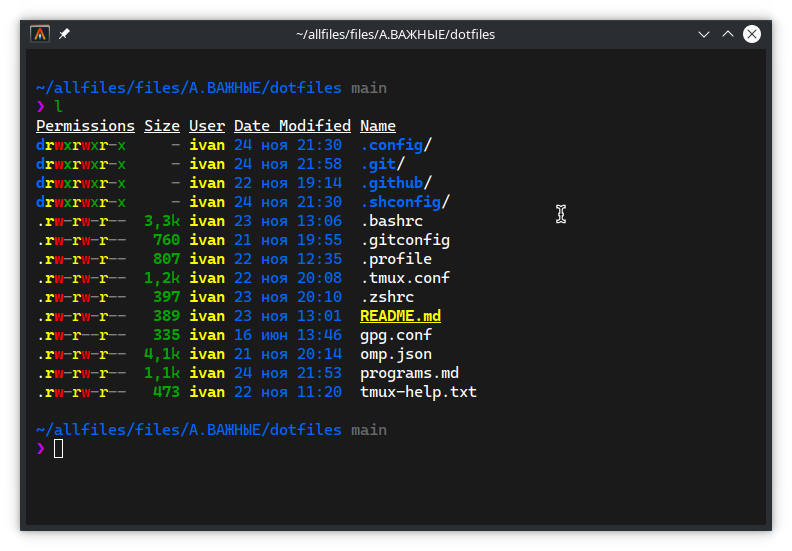

# dotfiles

Мои "dotfiles".

Структура сохранена.

Программы, шрифты и т.д. - [programs.md](programs.md)

P.S. Директория `.github` нужна **только** на GitHub.

## Установка

Инструкций **нет** и **не будет**. Лень писать =)
